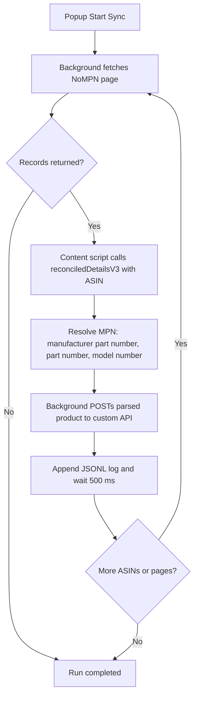

# Workflow Diagram

```mermaid
flowchart TD
    A[Popup Start Sync] --> B[Background fetches NoMPN page]
    B --> C{Records returned?}
    C -->|No| H[Run completed]
    C -->|Yes| D[Content script calls reconciledDetailsV3 with ASIN]
    D --> E[Resolve MPN: manufacturer part number, part number, model number]
    E --> F[Background POSTs parsed product to custom API]
    F --> G[Append JSONL log and wait 500 ms]
    G --> I{More ASINs or pages?}
    I -->|Yes| B
    I -->|No| H
```
